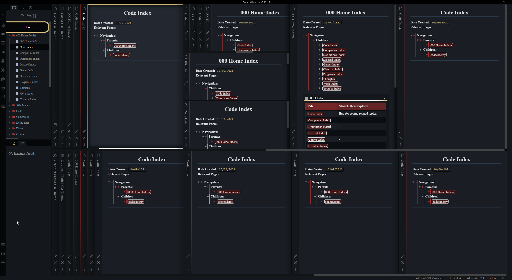
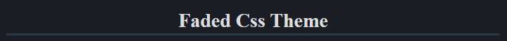
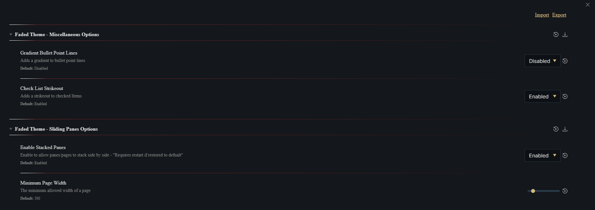
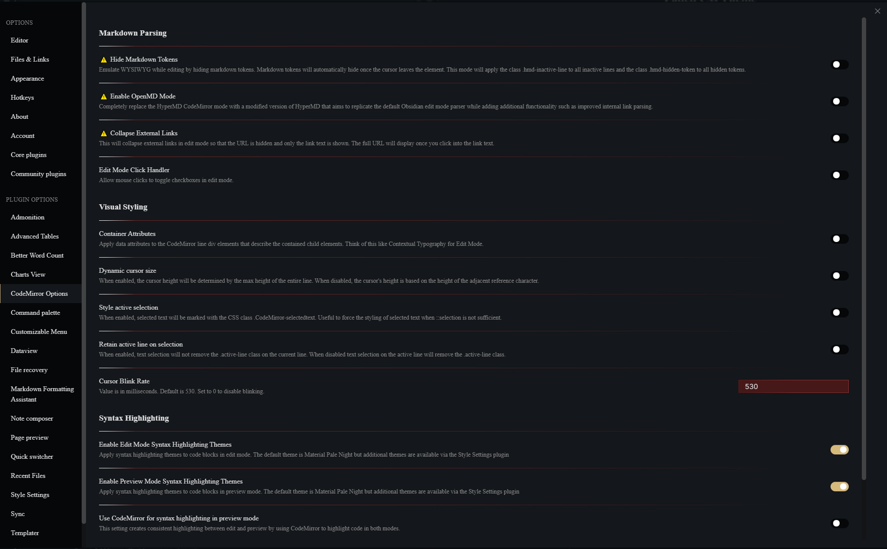

# READ ME
# Obsidian-Faded-Theme
Faded Theme For Obsidian By Josh Kasap

## IMPORTANT
- This theme uses custom modified css to enable sliding panes. Due to this use of the ***Sliding Panes Plugin*** https://github.com/deathau/sliding-panes-obsidian will cause some undesirable glitches.
- This theme makes use of the ***Style Settings Plugin*** https://github.com/mgmeyers/obsidian-style-settings It's encuraged to install this plugin in order to gain access various customizable options for this theme.
## Features 
### Advanced Sliding Panes
Faded uses advanced CSS to further improve sliding panes in obsidian. Now panes will scroll infinitely off the page allowing to stack panes to you're hearts content. Advanced sliding panes also allow you to implement far more layouts without breaking. Namely you can now split the view horizontally however many times you like to make 2 or more rows. Each row has full support for infinite sliding panes. This allows you to nest sliding rows, inside sliding rows, inside sliding rows, however many times you feel is necessary. 

### Custom HTML Snippets
Faded ATM supports HTML snippets to help spice up your notes. 
- `<div class="pageTitle">Your Text Here</div>` 
	- 
-  `<div class="pageTitle neutral">Your Text Here</div>`
	- 
- Use of an h1 tag for a page title adds clutter usually results in the rest of the page being restricted to h2-h6. Use of this snippet makes page titles stand out while avoiding waste of a good h1 tag. 
- Add the class small to get small text to display in the snippet instead of the default large EX: `<div class="pageTitle neutral small">Your Text Here</div>` Useful for fancy Admonitions (requires Admonitions Plugin)
## Style Settings Options
- Changes to these options usually work instantly but sometimes you need obsidian to restart obsidian for changes to work properly
- 
- You can chose to make panes not stack, This gives you more screen space when many panes are open.
-  You can modify the minimum page/pane width. This can be useful for people using obsidian at lower or higher resolutions. The default setting is made with 1440p screen in mind
-  You can enable bullet point gradient lines. This is off by default because it can make when a bullet begins and ends. But some may prefer the style. 
-  You can make it so checking items off a checklist won't cause the checked items text to be dimmed and crossed out.
## Supported Plugins
Faded currently supports full or partial styling of the following plugins. 
- **Style Settings Plugin: **https://github.com/mgmeyers/obsidian-style-settings
- **CodeMirror Options: **https://github.com/nothingislost/obsidian-codemirror-options
	- Supported Options
		- **Enable Edit Mode Syntax Highlighting Themes** *(recommended)*
		- **Enable Preview Mode Syntax Highlighting Themes** *(recommended)*
- **Copy Button For Code Blocks: **https://github.com/jdbrice/obsidian-code-block-copy
- **Obsidian Admonition: **https://github.com/valentine195/obsidian-admonition
	- 
	- Use below codeblock as a reference to make my fancy custom Admonition
	- 
		``` ad-note
		title: <div class="pageTitle small">Backlinks</div>
		collapse: closed
		icon: list
		color: 

		- [[BeamNG]]
		- [[Fault - Game]]
		- [[MineCraft]]
		- [[Rocket League]]
		```
# Kudos
- **SlRvb** and his ***ITS-Theme*** https://github.com/SlRvb/Obsidian--ITS-Theme It was a great reference and especially helped with getting the folder, page, and bullet point icons. It also was very helpful in getting the nested lines which can be seen in bullet points lists, the file navigation pane, and the outline pane. 
- Andy for his initial sliding panes CSS

