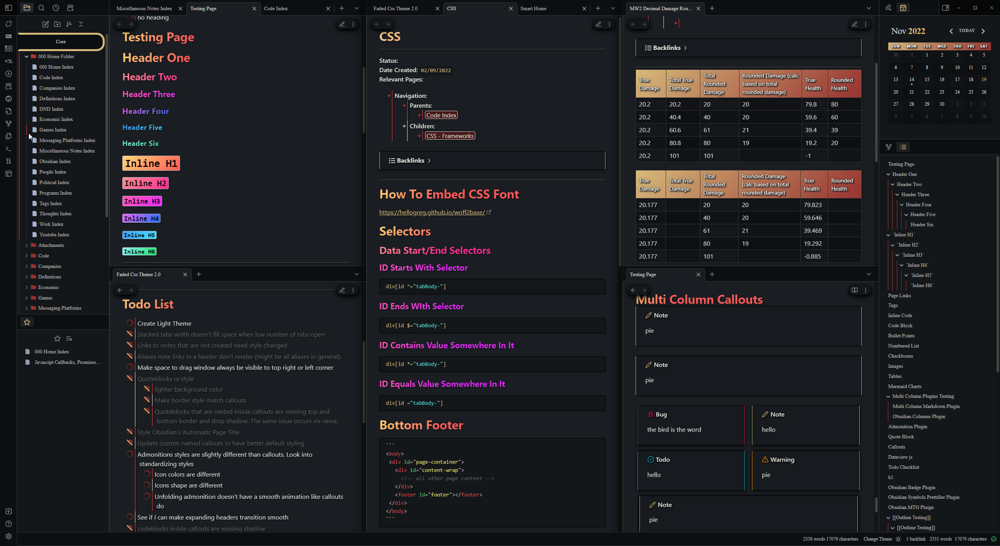
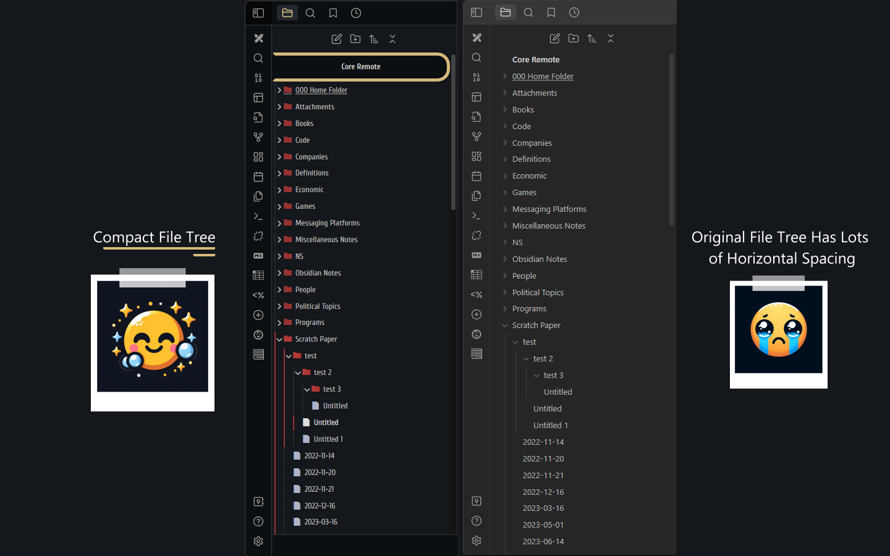

# Obsidian-Faded-Theme
Faded Theme For Obsidian By Josh Kasap

## IMPORTANT
- This theme uses custom modified css to enable sliding panes. Due to this use of the ***Sliding Panes Plugin*** https://github.com/deathau/sliding-panes-obsidian will cause some undesirable glitches.
- This theme makes use of the ***Style Settings Plugin*** https://github.com/mgmeyers/obsidian-style-settings It's encuraged to install this plugin in order to gain access various customizable options for this theme.
## Features 
### Advanced Sliding Panes
Faded uses advanced CSS to further improve sliding/stacked panes/tabs in obsidian. With the release of Obsidian 1.0 we now have native support for unstacked and stacked tabs. This is great but what if you could have unstacked tab panes that also stacked like sliding panes? Well that's what this theme does! 
### Highlight And Indent/Depress Active Note

### Tables

### Headers (Header Icons Optional With Style Settings Plugin)

### Headers Can Also Contain Links To Other Notes Or Tags

### Bullet Lists, Numbered Lists, And Checkboxes

### Obsidian Admonition/Callouts:

### File Tree:

### Outliner:

### Custom HTML Snippets
Faded ATM supports HTML snippets to help spice up your notes. 
- `
Your Text Here
` 

- Use of an h1 tag for a page title adds clutter usually results in the rest of the page being restricted to h2-h6. Use of this snippet makes page titles stand out while avoiding waste of a good h1 tag. It can also be used to center and underline any word you want. 
- Add the class small to get small text to display in the snippet instead of the default large EX: `
Your Text Here
` Useful for fancy Admonitions (requires Admonitions Plugin)
## Style Settings Options
- Changes to these options usually work instantly but sometimes you need obsidian to restart obsidian for changes to work properly

- You can chose to make panes not stack, This gives you more screen space when many panes are open.
-  You can modify the minimum page/pane width. This can be useful for people using obsidian at lower or higher resolutions. The default setting is made with 1440p screen in mind
-  You can enable bullet point gradient lines. This is off by default because it can make it hard to tell when a bullet begins and ends. But some may prefer the style. 
-  You can make it so checking items off a checklist won't cause the checked items text to be dimmed and crossed out. (This feature is Broken ATM)
## Supported Plugins
Faded currently supports full or partial styling of the following plugins. 
- **Style Settings Plugin: **https://github.com/mgmeyers/obsidian-style-settings
- **Calendar Plugin: **https://github.com/liamcain/obsidian-calendar-plugin

## Plugins Planned For Support
- **CodeMirror Options: **https://github.com/nothingislost/obsidian-codemirror-options
	- Support for this plugin is unavalible for now but planned in the future. 
## Todo List (As of 11-15-2022)

# Kudos
- **SlRvb** and there ***ITS-Theme*** https://github.com/SlRvb/Obsidian--ITS-Theme It was a great reference and especially helped with getting the folder, page, and bullet point icons. It also was very helpful in getting the nested lines which can be seen in bullet points lists, the file navigation pane, and the outline pane. 
- **caro401** and there ***Royal Velvet Theme*** https://github.com/caro401/royal-velvet It was a great insperation/guide for my the gradiant headers and table header styles.
- Andy for his initial sliding panes CSS

